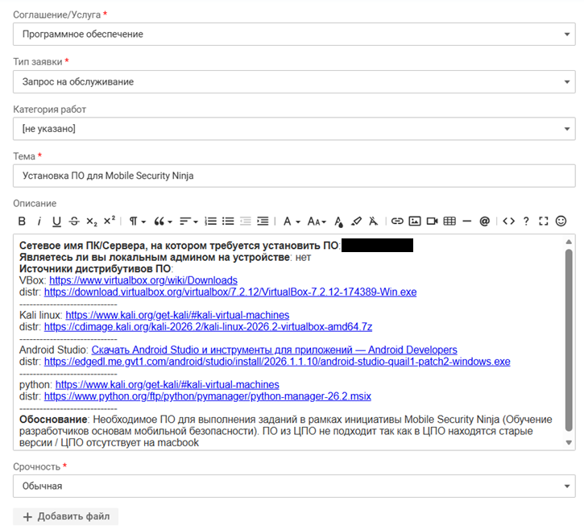

# Базовый минимум утилит на MSN
Привет! Это инструкция, которая поможет тебе с установкой всего необходимого для курса MSN на твой ноутбук.
Инструкция поделена на несколько частей, так как большую часть софта мы устанавливаем в виртуальную машину с Kali linux.

### Для начала приводим список программ, которые потребуется установить себе на локальную машину, **предварительно создав заявку в сервис деск**:
- Гипервизор (UMT, VMware, VirtualBox) (выбираем исходя из операционной системы. [Инструкция для Макбук на М чипах прилагается](https://github.com/SibCTFDev/MSN_install_tools/blob/main/%D0%A3%D1%81%D1%82%D0%B0%D0%BD%D0%BE%D0%B2%D0%BA%D0%B0%20%D0%B2%D0%B8%D1%80%D1%82%D1%83%D0%B0%D0%BB%D1%8C%D0%BD%D0%BE%D0%B9%20%D0%BC%D0%B0%D1%88%D0%B8%D0%BD%D1%8B%20Kali%20%D1%81%20VMware%20%D0%B8%20UTM%20%D0%BD%D0%B0%20%D0%BC%D0%B0%D0%BA%20%D1%81%20M%20%D1%87%D0%B8%D0%BF%D0%BE%D0%BC.pdf))
- ADB мост для работы с андроид девайсами и эмуляторами
- Android Studio (ide, менеджер устройств). Заранее просим установить один эмулятор без гугл плей сервисов на android 14. Для работы с этим ПО понадобятся права администратора
- python3 (есть в ЦПО) и библиотеки frida frida-tools objection 
  ```bash
  sudo apt update
  sudo apt install python3 python3-full python3-pip -y
  python3 --version
  pip3 install frida==16.5.9 frida-tools==13.0.0 objection 
  ```

Пример заявки в nsd на всё ПО + kali linux:


### Настройка виртуальной машины с kalilinux:
в данном репозитории лежит скрипт? который исполнит и установит за вас все необходимые утилиты.</br>
Или можете скопировать команды ниже:
```bash
# Основные пакеты из репозитория
sudo apt update
sudo apt install -y apktool jadx adb default-jdk ghidra burpsuite 
```
Дополнительно просим вас убедиться, что папка share работает на вашей виртуальной машине, и перенести на неё uber-apk-signer (файл есть в репозитории)</br>

P.S.> Если вы продвинутый linux пользователь и считаете, что kali linux отвратная 💩 - вы можете поставить себе любой другой дистрибутив linux в виртуальную машину и решать все проблемы в нём самостоятельно, не надеясь на нашу помощь. </br>
P.S.v2.0> Если вы увидели в репозитории UMT Arch Linux и решили стать топовым Arch linux юзером - мы поставим за вас свечку... Но помогать в решении проблем не станем, так как это требует отдельного курса по работе с данным дистрибутивом... </br>
P.S.v3.0> I use Arch BTW ❤️ </br>
